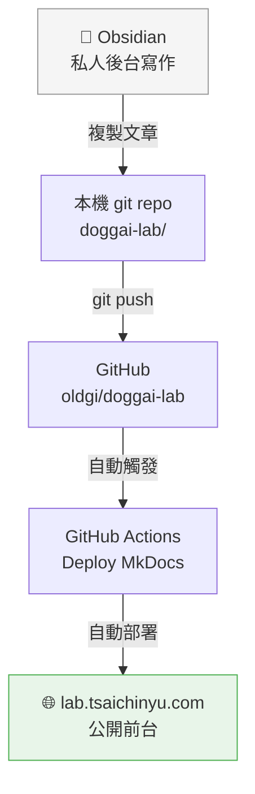
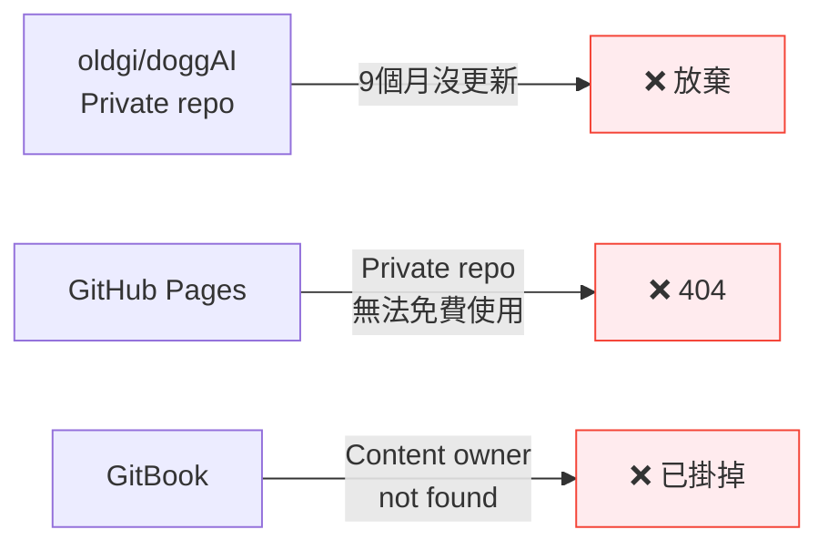
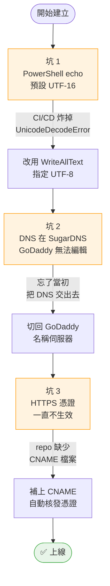

---
date: 2026-05-05
tags: [doggai-lab, workflow, mkdocs, github-actions, aj53]
status: published
published_date: 2026-05-10
---

# 工作流比模型重要：發布流水線建立全紀錄

*doggAI AI Lab-01 | 2026-05-05*

---

> 我不是在玩玩具，我是在建立一個可以持續累積的實驗系統。

---

## 先想清楚終點

很多人玩 AI 的路徑是：下載模型 → 跑幾張截圖 → 興奮三天 → 結束。

今天不跑模型。今天要做的事只有一件：**建立一條從「寫」到「發」的自動流水線**。

沒有這條流水線，之後跑再多模型、做再多實驗，都只是存在硬碟裡的截圖。

目標流水線長這樣：

從寫完到上線，目標是**只需要一個 git push**。

---

## 先盤點現況

動手之前，先確認舊的東西還在不在：

三個都不能用。與其花時間修，不如從零開始把基礎做對。

**決策：放棄舊 `oldgi/doggAI`，新建 `oldgi/doggai-lab`（Public）**

> 未來可期，過去不可追。

---

## 今天踩的三個坑

每個坑都不難，但每個坑都要踩過才知道。

---

## 今天建起來的東西

| 步驟 | 結果 |
|---|---|
| 新建 `oldgi/doggai-lab`（Public） | ✅ |
| MkDocs + Material theme 設定 | ✅ |
| GitHub Actions 自動部署 | ✅ |
| 修正 UTF-8 編碼問題 | ✅ |
| GoDaddy DNS 切換與 CNAME 設定 | ✅ |
| HTTPS 憑證自動核發 | ✅ |
| `lab.tsaichinyu.com` 上線 | ✅ |

---

## 麻瓜時刻

**🤦 以為 DNS 設定很簡單**
忘了當初把 DNS 託管給第三方，GoDaddy 介面怎麼改都沒反應。花了一段時間才發現問題根本不在 GoDaddy 設定本身，而是名稱伺服器指到別人那邊去了。

**🤦 HTTPS 等了很久還是灰色**
以為是 DNS 還沒生效，繼續等。等了很久，才發現 repo 根目錄缺少 `CNAME` 檔案——GitHub Pages 沒辦法確認這個網域的歸屬，憑證根本不會核發。補上 `CNAME` 之後，幾分鐘內就好了。

---

## 基礎設施是一次性的痛苦

今天花了幾個小時在「搭舞台」。

這不是最性感的工作。沒有模型跑起來的興奮感，沒有數字可以截圖，只有一個又一個的錯誤訊息。

但基礎設施有一個特性：**做好之後就不用再做了**。往後每次只要 git push，網站就自動更新。這個投資，值得。

---

*工具：MkDocs + Material | GitHub Actions | GoDaddy | HP Z2 Mini G1a*
